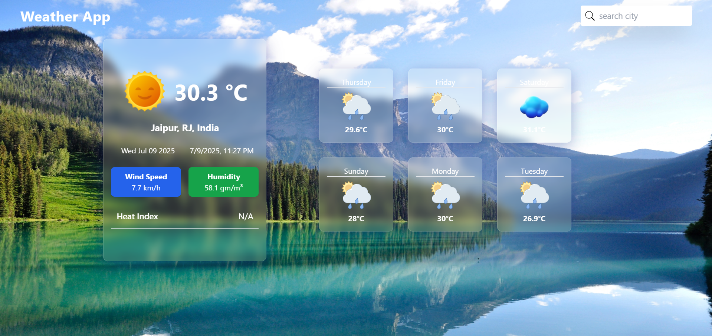

# 🌤️ Weather App 

A simple React-based weather app that fetches and displays real-time weather data using the [Visual Crossing Weather API](https://www.visualcrossing.com/).

---

## 📌 Features

- 🔍 Search weather for any city
- 🌡️ View temperature, humidity, conditions, etc.
- 📅 24-hour weather data (fetched in metric units)
- ⚡ Clean, minimal UI with dynamic data loading

---

## 📷 Screenshot

---

## 🚀 Tech Stack

- **Frontend:** React (`useState`, `useEffect`, `Context API`)
- **API:** [Visual Crossing Weather API](https://www.visualcrossing.com/)
- **HTTP Client:** `axios`

